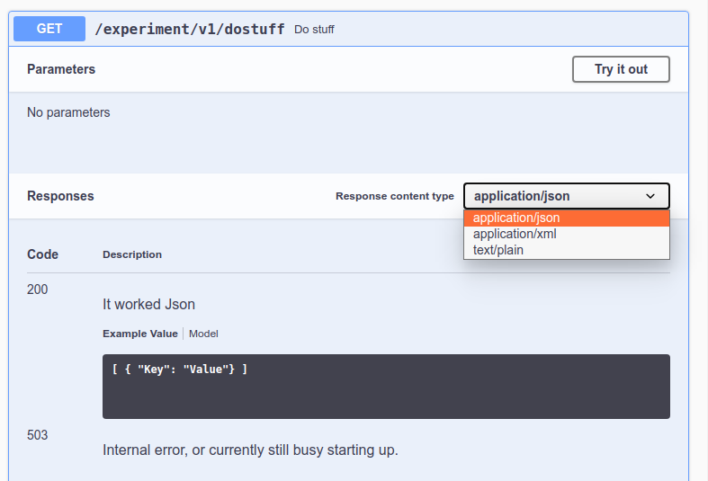
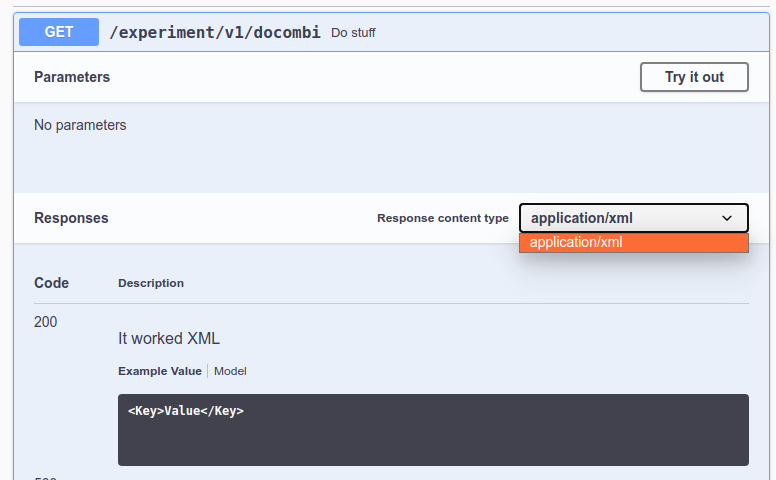

Bugreport
===

When I create a service and add Springfox to get a Swagger interface something strange happens.

When I annotate two methods with something like this (each with a different 'produces' value)

```
@GetMapping(
   value = API_BASE_PATH + "/dostuff",
   produces = APPLICATION_JSON_VALUE
)
```

In the swagger web ui I get for the one path with multiple types this:



However when I want the same thing to be availble under multiple paths and I do this
```
@GetMapping(
   value = { API_BASE_PATH + "/docombi", API_BASE_PATH + "/docombi/json" },
   produces = APPLICATION_JSON_VALUE
)
```

then in the swagger web ui I no longer get all defined types for the url.


